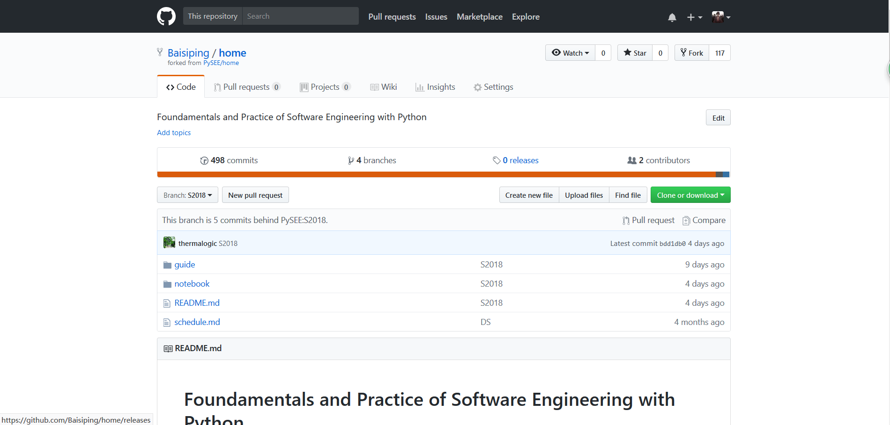

# practice01
## 03015413 白思平
# 一、 个人账户
1、邮箱：[baisiping@foxmail.com](baisiping@foxmail.com)

2、账户主页(fork 仓库后 )

# 二、GitHub简介
>gitHub是一个面向开源及私有软件项目的托管平台，因为只支持git 作为唯一的版本库格式进行托管，故名gitHub。
gitHub于2008年4月10日正式上线，除了git代码仓库托管及基本的 Web管理界面以外，还提供了订阅、讨论组、文本渲染、在线文件编辑器、协作图谱（报表）、代码片段分享（Gist）等功能。目前，其注册用户已经超过350万，托管版本数量也是非常之多，其中不乏知名开源项目 Ruby on Rails、jQuery、python 等。
## GitHub 的功能
- 托管各种Git库，并提供一个web界面
- 创建代码仓库，可以保存代码的版本、分支、标记信息
- 提供海量的开源代码，可以根据需要查看并提取
- 下载已有的代码
- 书写个人博客，发布新文章
- 将感兴趣的仓库加入关注列表，如果有更新动态会有邮件通知
- 克隆其他开发者的仓库到自己的项目中，可以作为子模块使用或者二次开发
## GitHub对我们的用处
- 学习其他优秀开发者的程序，提高自己的编程水平
- 实现多人共同开发项目
- 基于Markdown的写作十分方便
- 搭建个人博客
- 关注最新IT动态
# 三、课程仓库简介
## 1、Home

这个仓库是我们学习编程理论的基础仓库，其中包含了：
- 课前的准备，例如在自己的电脑上搭建编程环境
- 课程文档
- 参考书籍与网站
- 常见问题的解答等

## 2、PyRankine

这个仓库是用Python编写的朗肯循环的模拟计算程序。其中介绍了计算思维和编程技巧，并一步步拆分讲解了朗肯循环的编程实例，同时也提供了许多参考网站和教程

## 3、SEUIF97仓库

这个仓库是东南大学开发者开发的水和水蒸气性质的计算模型共享库，基于IAPWS-IF97，使用Python语言编写，以便我们以后在工程实际中用来模拟水和水蒸气的热力性质，提高水和水蒸气性质的计算速度。仓库中的文件主要介绍了在windows和Linux环境下的使用方法，给出了很多DEMO程序，可供交互学习，是一个开源的仓库。 
